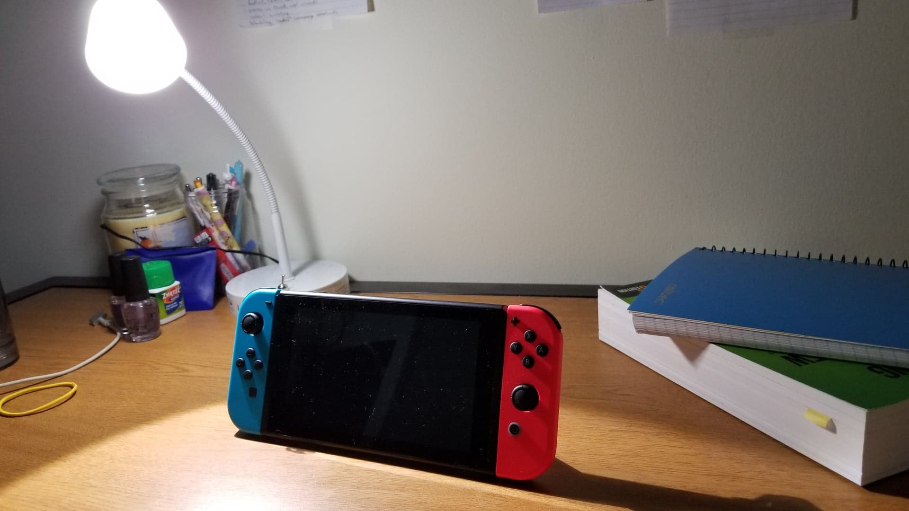
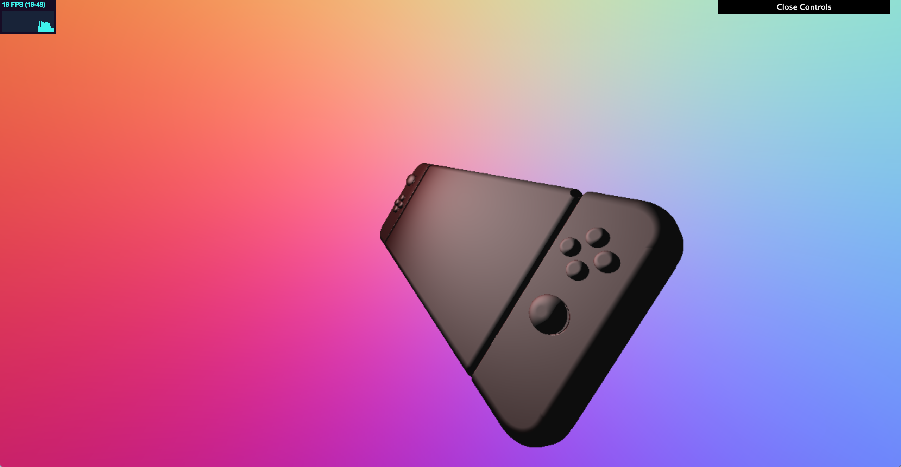
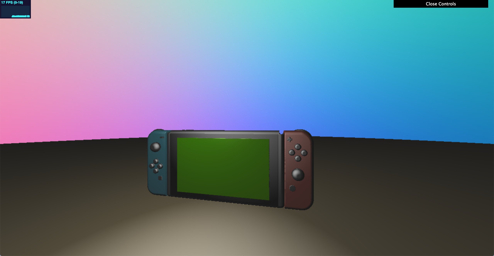
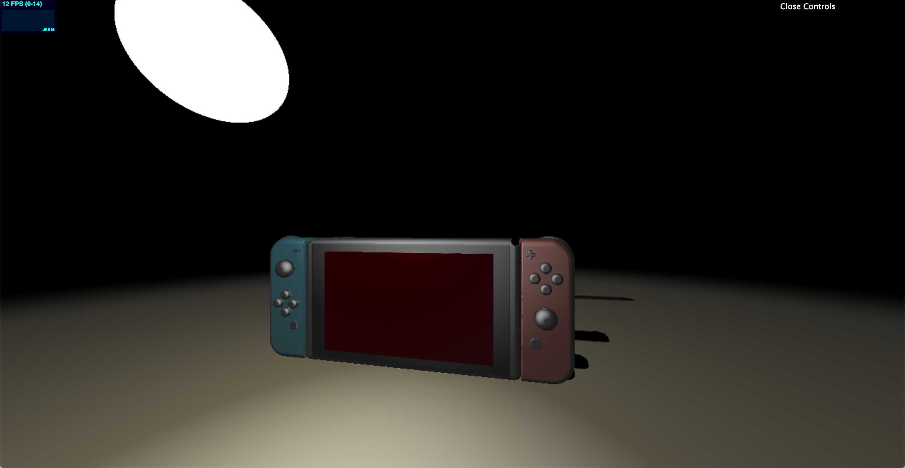
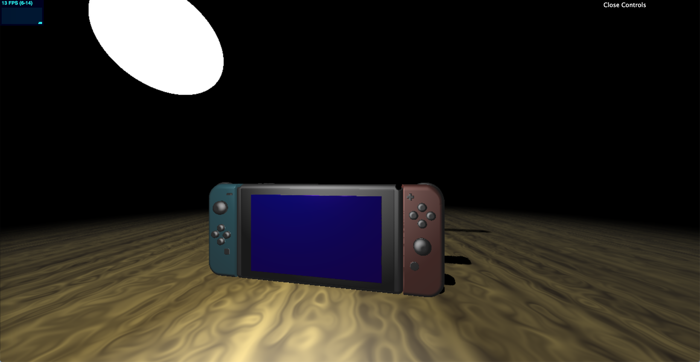
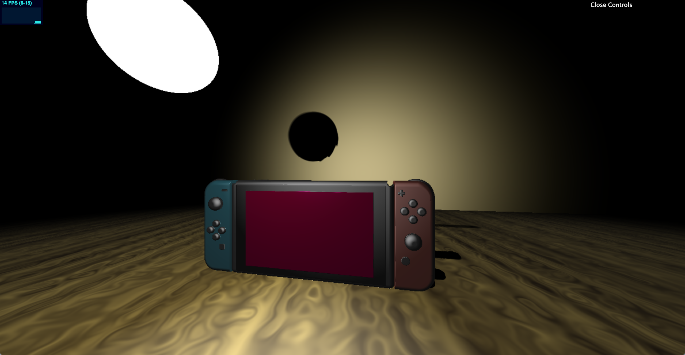
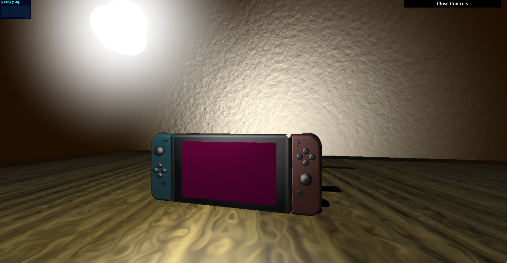
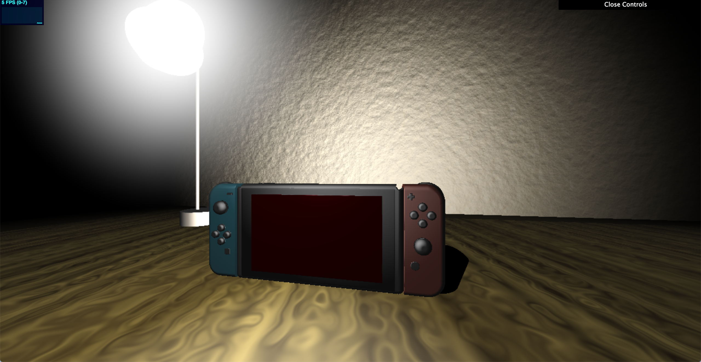
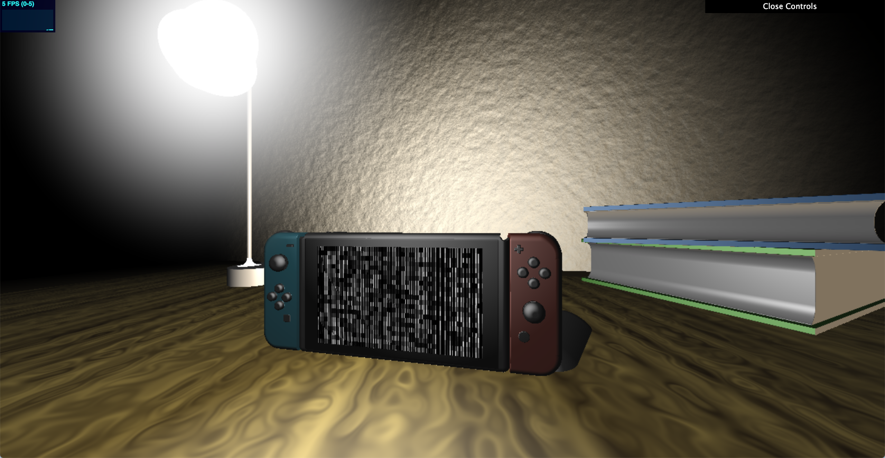
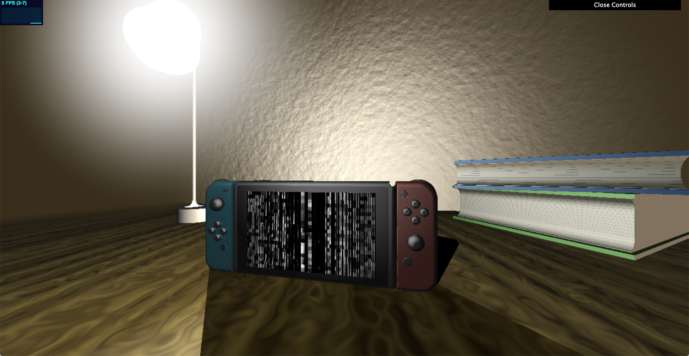

# Environment Setpiece
Name: Crystal Lee

PennKey: leecr

Email: leecr@seas.upenn.edu

[Website](www.crystaljlee.com)

## Live Project Demo
[Link]

## Project Description
This project is a procedurally modeled and animated environment scene created using a custom shader. It combines a variety of techniques, including noise functions, raymarching, and signed distance functions. 

For more information on my usage of raycasting and signed-distance functions, please refer to my previous project on [implicit surfaces](https://github.com/leecr97/implicit-surfaces).

My scene is a simplified and stylized recreation of my desk back in my dorm room and features my Nintendo Switch as the centerpiece, along with a few other belongings such as my lamp and some notebooks. These objects are created using several signed distance functions of simple polygons to create more complex shapes through boolean operations. For example, the controller of the Switch was created by combining a rectangular prism with two rounded cylinders to form the rounded edge and another rectangular prism to fill the distance between the two cylinders. The buttons are more rounded cylinders, while the joysticks were created by combining a cone shape with half of a torus.

The majority of the objects in the scene are illuminated using the Phong reflection model. This model uses the surface normal to calculate the amount of light the shape should receive at that point from a given light and its intensity. The illumination is calculated using other given parameters that determine the ambient color, diffuse color, specular color, and shininess coefficient.

The scene also makes use of several noise functions. Perlin noise is used both to texture the table and to apply height displacement onto the wall, and a third random noise function is used to create the tv static-esque effect on the screen of the Switch.

The largest source of light in the scene is of course the lamp, which illuminates the majority of the scene. The glow around the lamp is created by calculating the difference from our raymarched point in screen space to our lamp in screen space and making the points close to the lamp to have a "halo" effect. There are also other light sources around the camera to light the scene from the eye's point of view, so that things do not appear as excessively dark.

Other effects include a brown-hued distance fog and shadow effects. While there exists a graceful SDF-based shadow implementation, I unfortunately couldn't seem to make it work in my scene so I instead elected to hardcode my shadows and their placement and brightness. Using this method, I created shadows for my Switch from both the lamp and the other light sources.

Click on the live demo to see it in action!

## Progress Images

Reference Image

Modeling the Switch using SDFs

Initial scene setup

(Note the incorrect SDF-based shadows)

Texturing the table using noise functions

In the table's case, only the color is changed while the surface stays flat.

Adding light sources

Texturing the wall using noise functions

On the other hand, in the wall's case the noise is used to displace the surface and the SDF used to create the wall.

Refinement of light sources

Added books + noise function on the screen to create a static effect

Final scene, with softer lighting and more shadows

## References
Several articles from [the blog of Inigo Quilez]((http://www.iquilezles.org/www/index.htm)), including [3D SDF functions](http://www.iquilezles.org/www/articles/distfunctions/distfunctions.htm) and [Penumbra Shadows](http://www.iquilezles.org/www/articles/rmshadows/rmshadows.htm)

[Volumetric Rendering: Signed Distance Functions](https://www.alanzucconi.com/2016/07/01/signed-distance-functions/#part1) by Alan Zucconi

[Ray Marching and Signed Distance Functions](http://jamie-wong.com/2016/07/15/ray-marching-signed-distance-functions/) by Jamie Wong

[Distance Functions](http://www.iquilezles.org/www/articles/distfunctions/distfunctions.htm) by Inigo Quilez

[Phong reflection model](https://en.wikipedia.org/wiki/Phong_reflection_model) Wikipedia article

[The Book of Shader](https://thebookofshaders.com/) by Patricio Gonzalez Vivo and Jen Lowe